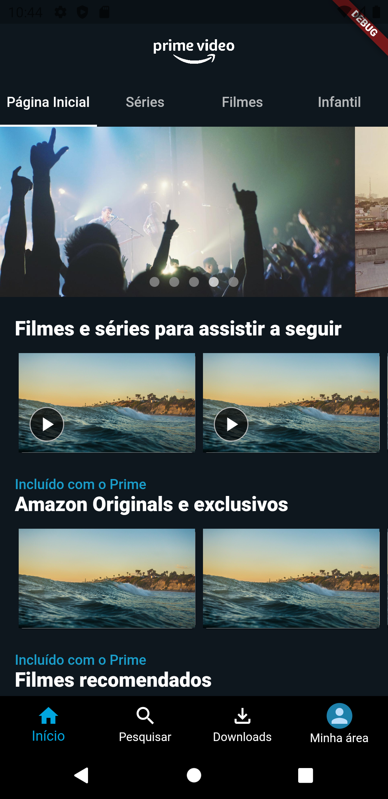

# Prime Video SpeedCoding

Este repositório contém o código do aplicativo construído no vídeo [Flutter - Prime Video SpeedCoding](https://youtu.be/YnoPapsGiGU).

Aproveito para reforçar que o aplicativo não implementa nenhuma funcionalidade, e mostra apenas a construção do layout da tela inicial do aplicativo Amazon Prime Vídeo.
Também reforço que o vídeo não é monetizado e que não existe patrocínio envolvido.

|  |  |
| ------------------------------------------ | -------------------------------------------- |
| Original                                   | Resultado                                    |

<br />

## Executando o projeto

Para executar este projeto localmente, certifique-se de ter o Flutter instalado e configurado em seu computador/laptop.

A seguir, basta clonar o projeto e na raíz, executar os comandos:

```bash
flutter pub get
flutter run
```
